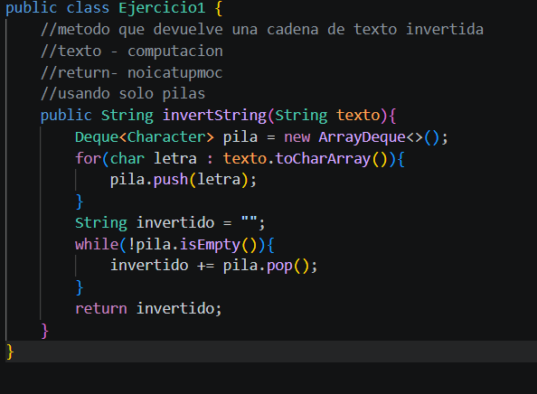

# Práctica:Dinamicas Lineales

## Datos del Estudiante
- **Nombre:** Santiago Satama
- **Curso:** Grupo 4
- **Fecha:** [08/06/2026]

---

## 1 implementacion 

**descripcion:** se utilizo linkedList,colas y pilas en cada una de las mismas se realizando de ejemplos de peekj(),pop();isEmpy();size();

