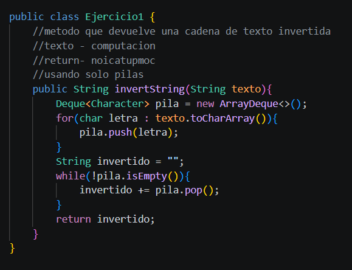
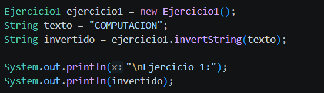
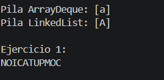
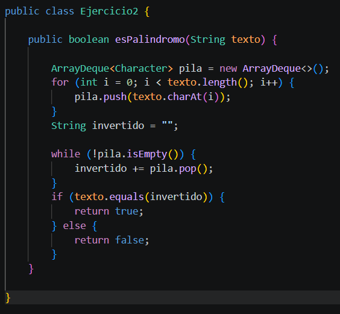
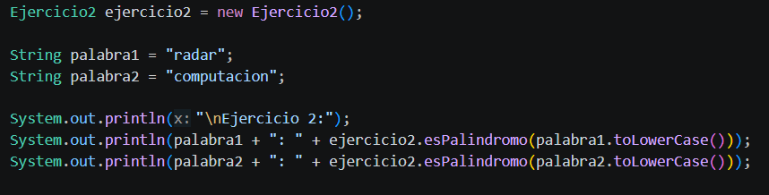
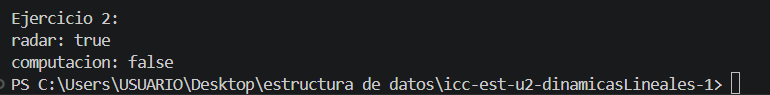

# Práctica:Dinamicas Lineales

## Datos del Estudiante
- **Nombre:** Santiago Satama
- **Curso:** Grupo 4
- **Fecha:** [08/06/2026]

---

## 1 implementacion 

**descripcion:** En esta parte de la práctica se utilizaron las estructuras dinámicas LinkedList, Queue y Stack. En cada una se realizaron ejemplos de operaciones básicas como peek(), pop(), isEmpty() y size(), con el objetivo de comprender cómo funcionan y cómo permiten insertar, eliminar y consultar elementos dentro de cada estructura.

## 2. Ejercicio Palíndromo

**Fecha:** [10/06/2026]

**Descripción:** En este ejercicio se creó un método para comprobar si una palabra es palíndroma utilizando una pila. El procedimiento consiste en guardar cada letra en la pila y luego sacarlas una por una para formar la palabra al revés. Después se compara la palabra original con la invertida y, si son iguales, el método devuelve true; de lo contrario devuelve false.
......

### Método implementado

